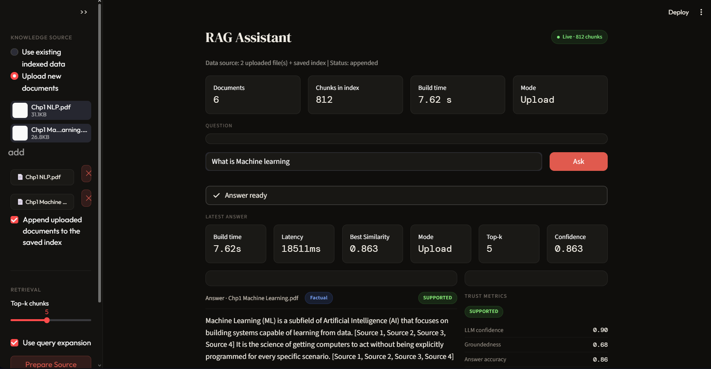
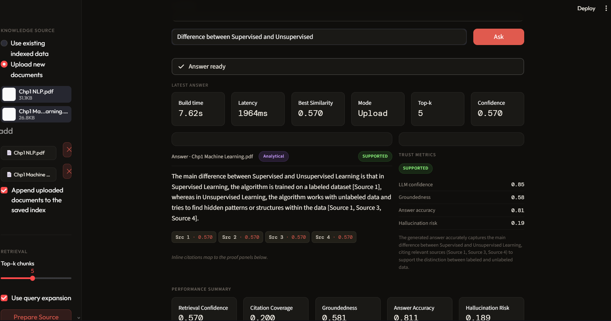
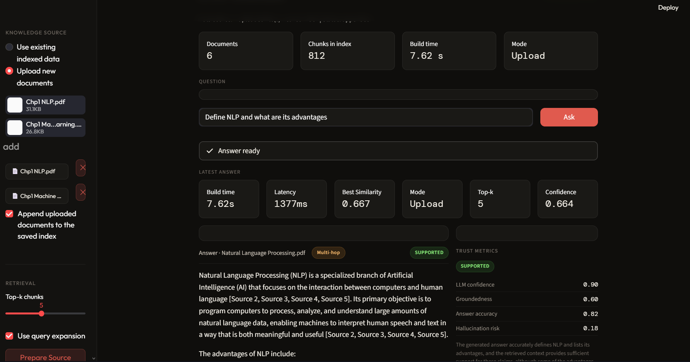

# 🧠 Query-Aware RAG Assistant

A production-ready **Retrieval-Augmented Generation (RAG)** system with **adaptive query classification**, hybrid retrieval (BM25 + FAISS), cross-encoder re-ranking, and a polished Streamlit UI — powered by Groq's LLaMA 3.1 and Google Gemini.

---

## ✨ Key Features

| Feature | Details |
|---|---|
| 🔍 **Adaptive Retrieval** | Automatically classifies queries as *factual*, *analytical*, or *multi-hop* and switches strategy |
| 🔀 **Hybrid Search** | BM25 (sparse) + FAISS (dense) retrieval fused for best coverage |
| 🏆 **Cross-Encoder Re-ranking** | MS-MARCO MiniLM re-ranker filters top chunks before generation |
| 🤖 **Multi-LLM Support** | Groq (LLaMA 3.1 8B) + Google Gemini backends |
| 📄 **Multi-format Loading** | Ingests PDF and DOCX documents from local folders or live uploads |
| 💾 **Persistent FAISS Index** | Saves & reloads the vector store so you don't re-embed every run |
| 🎨 **Dark-themed Streamlit UI** | Custom CSS theme with metrics, retrieval breakdown charts, and source display |

---

## 🏗️ Architecture

```
User Query
    │
    ▼
┌─────────────┐     ┌──────────────────┐
│  Classifier  │────▶│  Query Type       │
│  (zero-shot) │     │  factual /        │
└─────────────┘     │  analytical /     │
                    │  multi_hop        │
                    └────────┬─────────┘
                             │
              ┌──────────────┼──────────────┐
              ▼              ▼              ▼
         BM25 (sparse)  FAISS (dense)   Hybrid
              └──────────────┼──────────────┘
                             │
                    ┌────────▼────────┐
                    │  Cross-Encoder   │
                    │  Re-ranker       │
                    └────────┬────────┘
                             │
                    ┌────────▼────────┐
                    │  LLM Generator   │
                    │  (Groq / Gemini) │
                    └────────┬────────┘
                             │
                         Answer + Sources
```

---

## 📁 Project Structure

```
rag_project/
├── app.py                  # Streamlit UI entrypoint
├── main.py                 # CLI entrypoint
├── rag_pipeline.py         # Orchestrates the full pipeline
├── config.py               # Central configuration (models, paths, chunk sizes)
├── adaptive_retrieval.py   # BM25 + FAISS hybrid retrieval logic
├── classifier.py           # Zero-shot query type classifier
├── chunking.py             # Document chunking utilities
├── embeddings.py           # Sentence-transformer embedding wrapper
├── generator.py            # LLM answer generation (Groq + Gemini)
├── loader.py               # PDF / DOCX document loaders
├── retriever.py            # Retriever class (ties sparse + dense together)
├── reranker.py             # Cross-encoder re-ranking
├── vector_store.py         # FAISS index build / load / save
├── env_utils.py            # .env loading helper
├── requirements.txt
├── data/                   # Place your PDF / DOCX files here
│   ├── Introduction_to_Machine_Learning.pdf
│   └── Introduction_to_NLP.pdf
└── faiss_index/            # Auto-generated FAISS index (gitignored)
```

---

## 🚀 Quick Start

### 1. Clone the repo

```bash
git clone https://github.com/<your-username>/rag-project.git
cd rag-project
```

### 2. Create a virtual environment

```bash
python -m venv venv

# Windows
venv\Scripts\activate

# macOS / Linux
source venv/bin/activate
```

### 3. Install dependencies

```bash
pip install -r requirements.txt
```

### 4. Set up environment variables

Create a `.env` file in the project root:

```env
GROQ_API_KEY=your_groq_api_key_here
GOOGLE_API_KEY=your_google_api_key_here   # optional, for Gemini
```

> Get a free Groq API key at [console.groq.com](https://console.groq.com)

### 5. Add your documents

Drop PDF or DOCX files into the `data/` folder.

### 6. Run the Streamlit app

```bash
streamlit run app.py
```

### 7. (Optional) Run via CLI

```bash
python main.py
```

---

## ⚙️ Configuration

All settings live in `config.py`. Common things to tweak:

```python
CHUNK_SIZE       = 800    # characters per chunk
CHUNK_OVERLAP    = 150    # overlap between chunks
EMBEDDING_MODEL  = "sentence-transformers/all-MiniLM-L6-v2"
LLM_MODEL        = "llama-3.1-8b-instant"   # Groq model
RERANKER_MODEL   = "cross-encoder/ms-marco-MiniLM-L-6-v2"
```

Retrieval strategy per query type:

```python
RETRIEVAL_CONFIG = {
    "factual":    {"top_k": 3, "strategy": "sparse"},   # BM25 only
    "analytical": {"top_k": 6, "strategy": "dense"},    # FAISS only
    "multi_hop":  {"top_k": 8, "strategy": "hybrid"},   # BM25 + FAISS
}
```

---

## 🔑 API Keys

| Key | Where to get it | Required? |
|---|---|---|
| `GROQ_API_KEY` | [console.groq.com](https://console.groq.com) | ✅ Yes |
| `GOOGLE_API_KEY` | [aistudio.google.com](https://aistudio.google.com) | Optional |

---

## 🛠️ Tech Stack

- **Streamlit** — UI
- **LangChain** — document loading & FAISS wrapper
- **FAISS** — dense vector search
- **rank-bm25** — sparse keyword search
- **Sentence-Transformers** — text embeddings (`all-MiniLM-L6-v2`)
- **Cross-Encoders** — re-ranking (`ms-marco-MiniLM-L-6-v2`)
- **Groq API** — fast LLaMA 3.1 inference
- **Google Generative AI** — Gemini fallback

---

## 🤝 Contributing

Pull requests are welcome! For major changes, open an issue first.

1. Fork the repo
2. Create your feature branch (`git checkout -b feature/awesome-feature`)
3. Commit your changes (`git commit -m 'Add awesome feature'`)
4. Push to the branch (`git push origin feature/awesome-feature`)
5. Open a Pull Request

---
## 📸 UI Preview

<p align="center">
  
</p>

<p align="center">
  
</p>

<p align="center">
  
</p>

<<<<<<< HEAD
👉 [Click here to view full UI screenshots (PDF)](assets/UI_screenshots.pdf)

---

=======
>>>>>>> 2d0e96facad4f67d6b28e0172946398d306ba0e7
## 👨‍💻 Author

Made with ❤️ — feel free to reach out or drop a ⭐ if this helped you!
